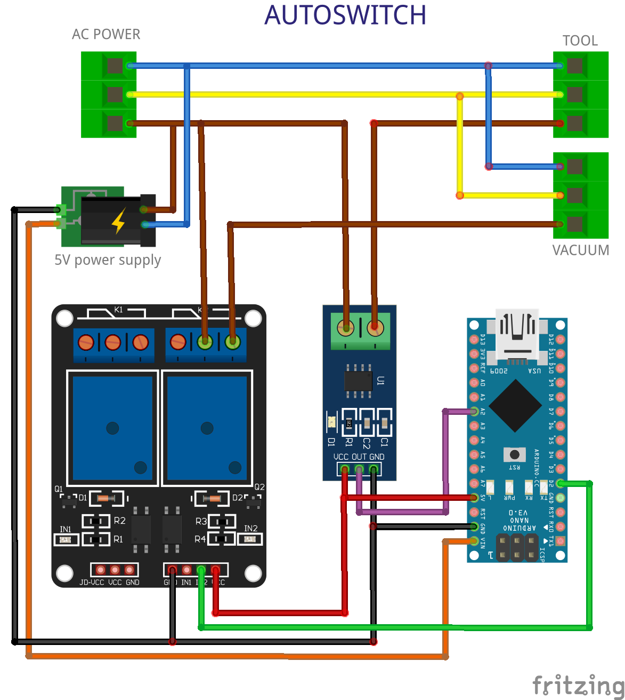
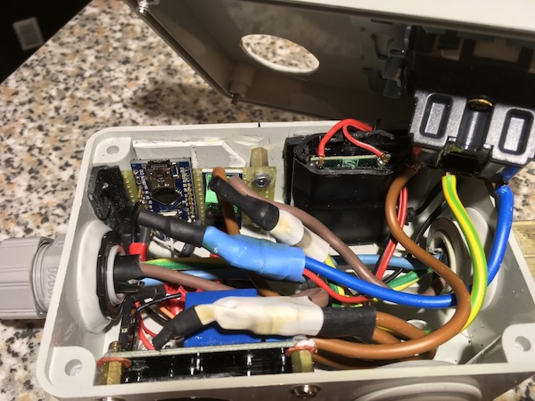
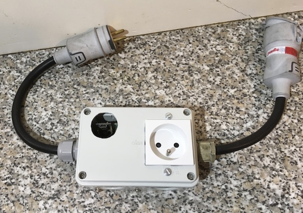

# AutoSwitch
Dispositif pour démarrage automatique d'aspirateur.

Aussi appelé prise maître-esclave.

## Principe
Ce montage permet d'asservir le démarrage d'un aspirateur à copeaux ou poussières à l'utilisation d'un outillage comme scie, rabot, ponceuse, défonceuse, etc.

[Vidéo de démonstration](https://youtu.be/bjviEHnPOQM).

## Electronique et autres composants
Le montage utilise un micro-contrôleur [Arduino Nano](https://www.arduino.cc/en/Guide/ArduinoNano) ou tout autre modèle similaire, un détecteur de courant à effet de Hall [ACS712](https://www.allegromicro.com/en/Products/Current-Sensor-ICs/Zero-To-Fifty-Amp-Integrated-Conductor-Sensor-ICs/ACS712.aspx), un relais et une alimentation 5V.

Les éléments se trouvent très facilement sur [Amazon](https://www.amazon.fr), [Ebay](https://www.ebay.fr), [AliExpress](https://aliexpress.com), [Banggood](https://www.banggood.com), etc.

Le boîtier est une boîte de dérivation électrique classique (magasins bricolage, Amazon, etc). Des presse-étoupes sécurisent les câbles.

## Arduino
Le programme lit les données du capteur ACS712 sur l'entrée analogique `A2` pendant 250ms. La tension sur l'entrée est proportionnelle à l'intensité détectée entre le secteur et la machine-outil. Comme le courant est alternatif, l'intensité aussi (_U=Z⋅I_, [loi d'Ohm](https://fr.wikipedia.org/wiki/Loi_d%27Ohm#En_courant_alternatif)): la valeur lue suit une sinusoïde centrée sur la valeur moyenne (Vcc/2 = 2.5V, soit 511 sur l'entrée analogique `A2`). Le déclenchement s'effectue donc sur une différence entre le min et le max des valeurs lues supérieure à un seuil fixé.

Le relais qui pilote la prise de l'aspirateur est contrôlé par la sortie digitale `D2`. Son démarrage est retardé d'une seconde pour éviter les pics de consommation et son arrêt de trois secondes.

## Montage

## Photos
Vue intérieure du boîtier. L'Arduino et l'ACS712 sont montés en shield d'une plaque d'essai. Celle-ci et le relais sont fixés avec des entretoises au boîtier. L'alimentation est assurée par un chargeur de smartphone découpé.

Une petite trappe aménagée sur le dessus permet d'accéder au port USB de l'Arduino et de voir les LED pour la mise au point ou pour le reprogrammer.

